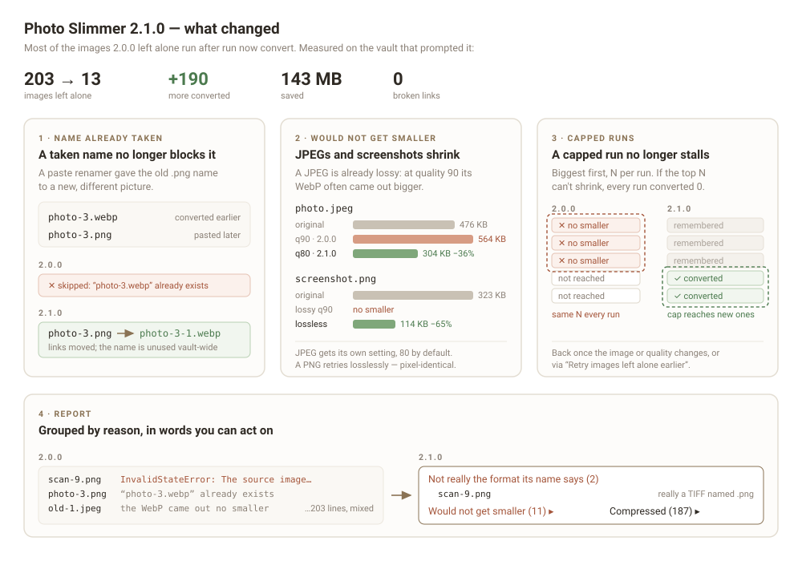

# Changelog

## 2.1.0

On the vault that prompted it, 203 images that 2.0.0 left alone run after run came down to 13: 190 more converted, 143 MB saved, no broken link.

### Images that used to be skipped are now converted

- **A taken `.webp` name no longer blocks a conversion.** Paste-renaming plugins number new images by checking only the exact name they are about to write, so once `photo-3.png` became `photo-3.webp`, the next pasted image was given `photo-3.png` — a different picture with the same stem. 2.0.0 skipped every one of these, and each conversion freed another name for the next paste to reuse. Such an image now becomes `photo-3-1.webp`, with its links moved over. The new name is unused anywhere in the vault, so no short link becomes ambiguous.
- **JPEGs have their own quality setting, 80 by default.** A JPEG has already been through a lossy encoder, and at the PNG setting of 90 its WebP often came out bigger than the original. At 80 the same files shrank by 28–36% in the samples measured. PNGs stay at 90.
- **A PNG that comes out no smaller is tried once more as lossless WebP.** Flat screenshots are where lossy WebP does worst and lossless does best — one went from 323 KB to 114 KB, pixel-for-pixel identical to the original.
- **A link to a same-named image in another folder no longer blocks a conversion.** A note embedding both `附件/图片/idea-2.png` and `附件/idea-2.png` used to be read as "a link was not moved", which rolled the conversion back. Now only a link that no longer resolves counts.

### Runs no longer stall

- **Images left alone are remembered**, and later runs do not spend their allowance on them again. Before, an image that would not get smaller stayed near the top of the biggest-first list, so once the largest *N* images were all ones that could not be converted, a run capped at *N* converted nothing, every time. An image comes back when it is edited or when the quality settings change. The new command **Retry images left alone earlier** brings them all back at once. The list is kept in `left-alone.json` in the plugin's folder.

### Clearer report

- **Skipped images are grouped by reason** — would not get smaller, not really the format its name says, and so on — in the window and in the copied text.
- **A file whose name lies about its contents is named as such.** A TIFF saved as `.png` used to be reported as `InvalidStateError: The source image could not be decoded`; it is now "it is really a TIFF file named .png, which Obsidian cannot display either". TIFF and HEIC are recognised from the file's first bytes.
- An image that got a numbered name is listed with the name it had before.

### Settings

- **WebP quality** is now **WebP quality for PNG** (still 90; 100 is lossless).
- New: **WebP quality for JPEG**, default 80.

Existing settings carry over unchanged.

## 2.0.0

The first version on the community store. Converts oversized images already in the vault to WebP, in a run you start yourself, and moves every link to the new file — including links inside fenced code blocks, which Obsidian's own index does not see. No file is created in the vault during a run, and any failure rolls back the image, its bytes and every note.
