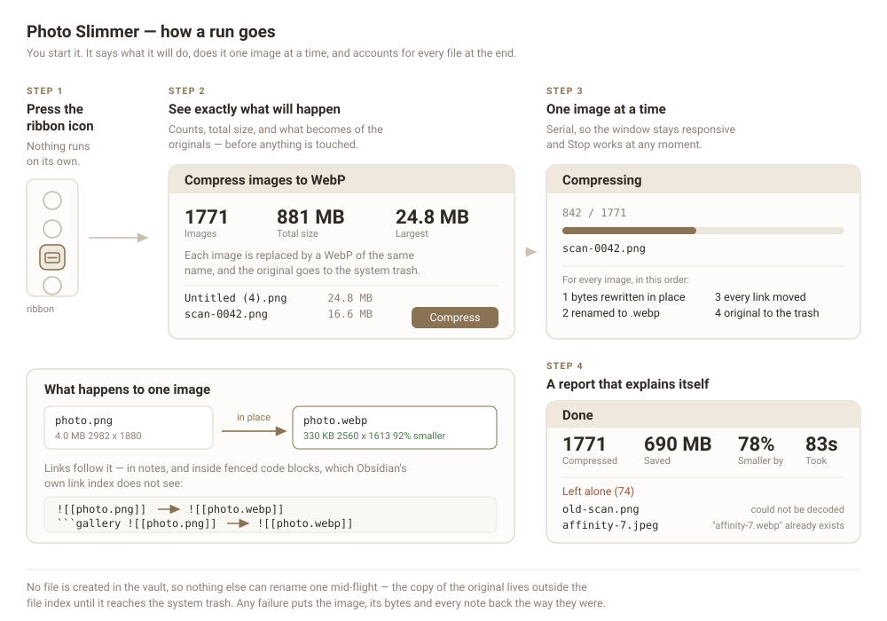

# Photo Slimmer

Converts the oversized images already sitting in your vault to WebP, in one pass you start yourself, and moves every link over to the new file — **including links written inside code blocks**, which Obsidian's own link index does not see.

On a real 8,500-image vault it turned 681 MB of PNGs into 63 MB across five runs, with no broken link and no file left mislabelled.



## What it does

Press the ribbon icon. You get a preview of exactly what is about to happen — how many images, how big, and what becomes of the originals — and nothing is touched until you confirm.

Each image is then converted in place:

- The file keeps its name and changes extension: `photo.png` → `photo.webp`.
- Every link that pointed at it is rewritten, including the ones in fenced code blocks.
- The original goes to the system trash under its own name, so it is recoverable.
- Anything that cannot be converted **safely** is left exactly as it was and listed at the end with the reason.

When the run finishes you get a report: how many, how much smaller, and — named, with a reason — every image that was skipped or could not be replaced.

## Why you might want it over the alternatives

Most image plugins compress at paste time, which does nothing for the images already in your vault. This one is for the backlog: it finds every image over a size threshold, biggest first, and works down the list.

Two things it is careful about, both learned from live vaults:

**Links inside code blocks.** If you embed images from a ````gallery` block or similar, Obsidian's metadata cache does not know those links exist and will not update them when a file is renamed. Photo Slimmer parses the markdown itself, so those links move too.

**Other plugins renaming your files.** Plugins that rename new attachments (Paste image rename, for example) race anything that creates a file. Photo Slimmer creates **no file in your vault at all** — the image is rewritten in place, and the copy of the original is written outside the vault's file index, where nothing else can see or rename it.

## Settings

| Setting | Default | What it does |
|---|---|---|
| Size threshold | 200 KB | Images at or below this are never touched |
| Images per run | 50 | Stop after this many, biggest first. 0 does the whole vault |
| Longest edge | 2560 px | Larger images are scaled down. 0 keeps the original size |
| WebP quality | 90 | Higher keeps more detail and produces bigger files |
| Minimum saving | 10% | Leave an image alone unless converting saves at least this much |
| The original file | System trash | Or replace it, keeping no copy |
| Excluded folders | — | One path per line; these and their subfolders are never touched |

A very tall image is scaled by its short edge instead, which never goes below 1080 px — capping the long edge alone would turn a long screenshot into an unreadable sliver.

## Two things worth knowing before you run it

**On an iCloud vault, the system trash still counts against your iCloud storage for 30 days.** The space is not actually freed until then. The preview dialog says so too.

**WebP is not readable everywhere.** Obsidian renders it on every platform, but if you export notes to somewhere that predates WebP support, those images will not show.

## What is left alone, and why

Every one of these is a normal outcome, reported by name:

- the WebP came out no smaller than the original
- the image could not be decoded (a file with the wrong extension, for example — a TIFF named `.png`)
- a `.webp` of that name already exists
- the note holding the link changed while the image was being converted

In the last case nothing is half-done: the image, its bytes and every note are put back the way they were before the failure.

## Installation

Community plugins → Browse → search for **Photo Slimmer**.

To install manually, copy `main.js`, `manifest.json` and `styles.css` into `<vault>/.obsidian/plugins/photo-slimmer/`.

## Development

```bash
npm install
npm run build
```

`src/compress.ts` has no Obsidian import, so the compression core can be bundled and exercised against real photos in a browser before it ever goes near a vault.

## License

MIT
